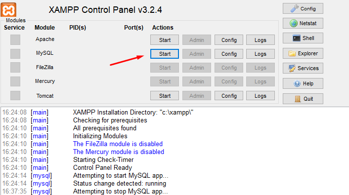

# 🎬 MovieWorld

MovieWorld is a simple social sharing platform where users can share their favorite movies of all time and express opinions by liking or hating each movie.

Built with **Laravel 9**, **Inertia.js**, and **Vue 3**.

---

## 🚀 Features

- 🧾 User registration & login
- 🎥 Add new movies with title and description()
- 👍👎 Like or hate any movie (except your own)
- 🔁 Change or retract your vote at any time
- 👤 Filter movies by user
- 📊 Sort movies by likes, hates, or date
- 🕵️ Guest users can view movie list and sign up

---

## 🛠 Tech Stack

- **Backend**: Laravel 9
- **Frontend**: Vue 3 + Inertia.js
- **Auth**: Laravel Breeze (Sanctum)
- **Styling**: Tailwind CSS
- **Database**: MySQL / SQLite

---

# Installation Guide

you may need to install the following tools before you can run the project:
1. PHP 8.0
2. Composer
3. Node.js (optional, for frontend development)
4. MySQL or SQLite (for database)

### Windows

1. **Install XAMPP**

  - [Download XAMPP](https://sourceforge.net/projects/xampp/files/XAMPP%20Windows/8.0.30/xampp-windows-x64-8.0.30-0-VS16-installer.exe)

   This tool come with PHP, MySQL pre-installed and provide an easy way to set up a local development environment.


2. **Verify the installation:**

   ```sh
   php -v
   ```
   you should see the PHP version as 8.0, like this:
`PHP 8.0.30 (cli) (built: Mar  1 2023 12:00:00) ( NTS Visual C++ 2019 x64 )`


3. **Install Composer** by downloading the installer from [getcomposer.org](https://getcomposer.org/download/).

   - Run the installer and follow the instructions to set up Composer globally.
   - After installation, you can verify it by running:

   ```sh
    composer -V
    ```

4. **Start MySQL services** from the XAMPP control panel(you can find it in the XAMPP installation directory, e.g., `C:\xampp\xampp-control.exe`).



---

## ⚙️ Project Setup Instructions

```bash
# 1. Clone the repo & navigate into the directory
git clone https://github.com/yorgos-dimitriadis/movieworld.git
cd movieworld

# 2. Install dependencies
composer install
npm install (optional - node.js is required)

# 3. Copy env and configure
cp .env.example .env
php artisan key:generate

# 4. Set your database credentials in `.env`

# 5. Run migrations & seed the database
php artisan migrate --seed

# 6. Start the dev server
php artisan serve
npm run dev (optional - node.js is required)

```

## 🌐 Access the App

Open your browser and go to:
http://localhost:8000
```
